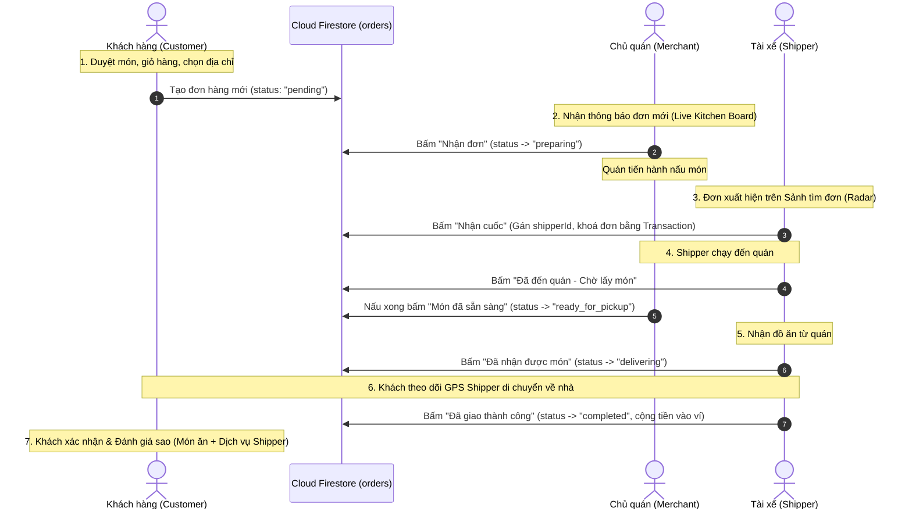
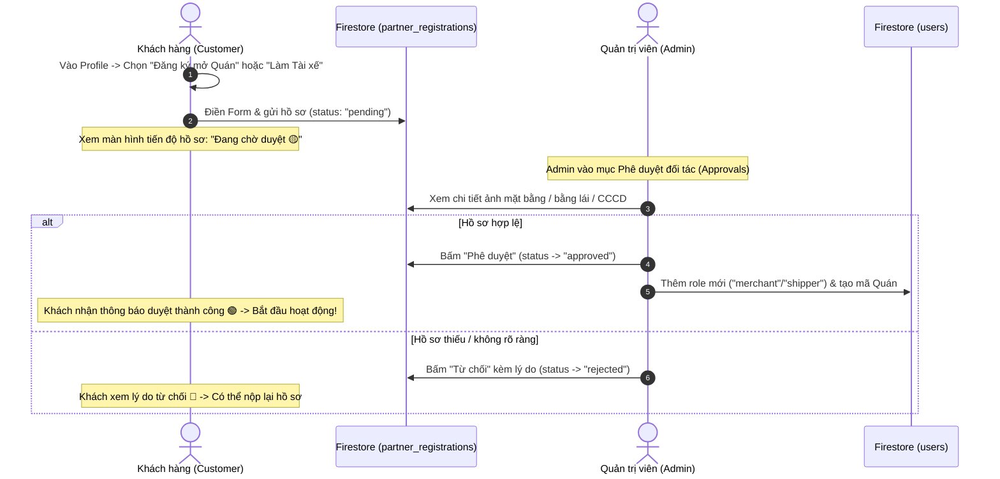

# 🍔 Food Delivery App - Hệ Thống Đặt & Giao Đồ Ăn Trực Tuyến

> **Đồ án Bài tập lớn Lập trình Thiết bị Di động (Mobile App Development)**  
> Ứng dụng xây dựng trên nền tảng **Flutter** kết nối **Firebase (Authentication, Cloud Firestore)**, phân quyền 4 vai trò: **Khách hàng (Customer)**, **Chủ quán (Merchant)**, **Tài xế (Shipper)**, và **Quản trị viên (Admin)**.

---

## 📌 Mục lục
1. [Công nghệ sử dụng](#-công-nghệ-sử-dụng)
2. [Cấu trúc mã nguồn](#-cấu-trúc-mã-nguồn)
3. [Tài khoản mẫu để kiểm thử](#-tài-khoản-mẫu-để-kiểm-thử-demo-accounts)
4. [Hướng dẫn cài đặt & Khởi chạy từ A - Z (Dành cho thành viên)](#-hướng-dẫn-cài-đặt--khởi-chạy-từ-a---z-dành-cho-thành-viên)
5. [Hướng dẫn nạp lại Database mẫu (Nếu cần)](#-hướng-dẫn-nạp-lại-database-mẫu-nếu-cần)
6. [Cấu trúc Cơ sở Dữ liệu (Cloud Firestore Schema)](#️-cấu-trúc-cơ-sở-dữ-liệu-cloud-firestore-schema)
7. [Sơ đồ & Luồng Hoạt động Toàn bộ Hệ thống (End-to-End Workflows)](#-sơ-đồ--luồng-hoạt-động-toàn-bộ-hệ-thống-end-to-end-workflows)
8. [Thành viên nhóm & Phân công công việc](#-thành-viên-nhóm--phân-công-công-việc)
9. [Quy chuẩn làm việc nhóm qua Git & Pull Request](#-quy-chuẩn-làm-việc-nhóm-qua-git--pull-request)

---

## 🛠 Công nghệ sử dụng
- **Frontend App:** Flutter SDK (>= 3.4.3), Dart SDK.
- **Quản lý trạng thái (State Management):** `provider`.
- **Cơ sở dữ liệu & Xác thực:** Google Firebase
  - `firebase_core`: Khởi tạo dịch vụ Firebase.
  - `firebase_auth`: Xác thực tài khoản (Email/Password).
  - `cloud_firestore`: Database thời gian thực lưu trữ Users, Restaurants, Foods, Orders,...
- **Tiện ích mở rộng:** `intl` (format tiền tệ VNĐ), `cached_network_image` (tải ảnh mượt mà), `geolocator` (định vị toạ độ GPS).
- **Backend Seeder:** Node.js (`firebase-admin`) nạp sẵn dữ liệu mẫu.

---

## 📁 Cấu trúc mã nguồn

```text
food_delivery_app/
├── backend/                        # Script Node.js nạp dữ liệu Firebase
│   ├── package.json
│   ├── seed.js                     # File script nạp tự động 7 collections + tạo Auth
│   └── serviceAccountKey.json      # Private key Admin Firebase (KHÔNG commit lên Git)
│
├── frontend/                       # Source code ứng dụng Flutter
│   ├── pubspec.yaml                # Quản lý các thư viện (dependencies)
│   ├── android/                    # Cấu hình Android (đã cấp quyền GPS, Internet, minSdk 21)
│   └── lib/
│       ├── main.dart               # Điểm bắt đầu app, cấu hình MultiProvider
│       ├── firebase_options.dart   # File cấu hình kết nối Firebase của dự án
│       ├── constants/
│       │   └── app_colors.dart     # Bảng màu chuẩn dùng chung (Primary, Background,...)
│       ├── models/
│       │   └── user_model.dart     # Khung dữ liệu người dùng (Customer, Merchant, Shipper, Admin)
│       ├── services/
│       │   └── auth_service.dart   # Xử lý đăng nhập, đăng ký, đồng bộ Firebase Auth & Firestore
│       ├── providers/
│       │   └── auth_provider.dart  # Quản lý trạng thái đăng nhập toàn ứng dụng
│       ├── widgets/
│       │   ├── custom_button.dart  # Nút bấm chuẩn UI (hỗ trợ loading indicator)
│       │   └── custom_text_field.dart # Ô nhập text/mật khẩu chuẩn UI
│       └── screens/
│           ├── auth/
│           │   ├── auth_wrapper.dart   # Bộ điều hướng tự động nhảy vào đúng màn theo Role
│           │   └── login_screen.dart   # Màn đăng nhập (có sẵn nút bấm 1-chạm điền tài khoản)
│           ├── customer/               # Giao diện Khách hàng (Home, Chi tiết món, Giỏ hàng)
│           ├── merchant/               # Giao diện Chủ quán (Quản lý món, Nhận duyệt đơn)
│           ├── shipper/                # Giao diện Tài xế (Bật/Tắt online, Nhận đơn, Giao hàng)
│           └── admin/                  # Giao diện Admin (Duyệt quán/shipper, Quản lý voucher)
└── README.md
```

---

## ⚡ Tài khoản mẫu để kiểm thử (Demo Accounts)

Hệ thống đã có sẵn 4 tài khoản phân quyền trên Firebase Authentication & Firestore. Bạn có thể nhấn trực tiếp vào các nút gắn sẵn trên màn hình Đăng nhập để tự động điền:

| Vai trò (Role) | Email | Mật khẩu | Màn hình tương ứng sau đăng nhập |
| :--- | :--- | :---: | :--- |
| **👤 Khách hàng (Customer)** | `khach@gmail.com` | `password123` | Màn hình duyệt món & đặt hàng |
| **🏪 Chủ quán (Merchant)** | `chuquan@gmail.com` | `password123` | Dashboard Quán ăn (Cơm Tấm Cali) |
| **🛵 Tài xế (Shipper)** | `taixe@gmail.com` | `password123` | Kênh Tài xế (Xem ví, bật trực tuyến) |
| **🛡️ Quản trị viên (Admin)** | `admin@gmail.com` | `password123` | Kênh Quản trị (Duyệt hồ sơ đối tác) |

---

## 🚀 Hướng dẫn cài đặt & Khởi chạy từ A - Z (Dành cho thành viên)

> Dành cho các bạn trong nhóm mới kéo code về máy lần đầu tiên. Làm theo đúng từng bước bên dưới:

### Bước 1: Yêu cầu chuẩn bị trên máy tính
- Cài đặt **Git** ([Tải tại đây](https://git-scm.com/)).
- Cài đặt **Flutter SDK** (Khuyên dùng bản 3.22 trở lên) ([Hướng dẫn tải](https://docs.flutter.dev/get-started/install)).
- Biên tập code: Khuyên dùng **VS Code** (đã cài extension *Flutter* và *Dart*) hoặc **Android Studio**.

### Bước 2: Clone dự án về máy
Mở Terminal (Command Prompt hoặc PowerShell) và chạy lệnh:
```bash
git clone https://github.com/Khacsy05/food-delivery-app.git
cd food-delivery-app
```

### Bước 3: Cài đặt thư viện cho App Flutter
Di chuyển vào thư mục `frontend` và tải toàn bộ thư viện:
```bash
cd frontend
flutter pub get
```

### Bước 4: Chạy ứng dụng

#### 👉 Cách 1: Chạy trên Trình duyệt Web (Nhanh nhất, không cần cài máy ảo nặng)
```bash
flutter run -d chrome
```
*(Trình duyệt Chrome sẽ tự động mở lên màn hình Đăng nhập).*

#### 👉 Cách 2: Chạy trên Máy ảo Android hoặc Điện thoại thật cắm cáp
1. Bật máy ảo Android (Android Emulator) hoặc cắm điện thoại Android (đã bật chế độ `USB Debugging`).
2. Kiểm tra Flutter đã nhận diện thiết bị chưa:
   ```bash
   flutter devices
   ```
3. Khởi chạy app:
   ```bash
   flutter run
   ```

---

## 🔄 Hướng dẫn nạp lại Database mẫu (Nếu cần)

Trong trường hợp database bị xoá trắng hoặc muốn reset lại dữ liệu gốc ban đầu:
1. Mở terminal tại thư mục gốc của dự án.
2. Di chuyển vào thư mục `backend`:
   ```bash
   cd backend
   ```
3. Đảm bảo file `serviceAccountKey.json` đã được đặt trong thư mục `backend/` *(liên hệ Leader lấy file này)*.
4. Cài package và chạy script:
   ```bash
   npm install
   node seed.js
   ```
> Script sẽ tự động nạp mới 7 collections lên Firestore và khởi tạo tài khoản đăng nhập trên Firebase Authentication.

---

## 🗄️ Cấu trúc Cơ sở Dữ liệu (Cloud Firestore Schema)

Hệ thống Firestore được thiết kế gồm **7 Collections chính**. Dưới đây là bảng đặc tả chi tiết từng collection:

### 1. Collection `categories` (Danh mục món ăn)
*Hiển thị danh mục cuộn ngang ở Trang chủ (Cơm, Bún/Phở, Trà sữa,...).*

| Tên trường (Field) | Kiểu dữ liệu (Type) | Mô tả chi tiết | Ví dụ |
| :--- | :--- | :--- | :--- |
| `categoryId` | String | Mã định danh danh mục (Document ID) | `"CAT_COM"` |
| `name` | String | Tên hiển thị của danh mục | `"Cơm"` |
| `iconUrl` | String | Đường link ảnh icon danh mục | `"https://images.unsplash.com/..."` |
| `displayOrder` | Number | Thứ tự sắp xếp hiển thị trên màn hình | `1` |

---

### 2. Collection `users` (Thông tin người dùng & Phân quyền)
*Lưu thông tin hồ sơ và vai trò hoạt động của từng tài khoản.*

| Tên trường (Field) | Kiểu dữ liệu (Type) | Mô tả chi tiết | Ví dụ |
| :--- | :--- | :--- | :--- |
| `uid` | String | Mã ID khớp với Firebase Authentication | `"USER_CUSTOMER_01"` |
| `name` | String | Họ và tên người dùng | `"Nguyễn Văn Khách"` |
| `email` | String | Email đăng nhập | `"khach@gmail.com"` |
| `phone` | String | Số điện thoại liên hệ | `"0987111222"` |
| `avatarUrl` | String | Link ảnh đại diện | `"https://images.unsplash.com/..."` |
| `roles` | Array (String) | Danh sách vai trò sở hữu | `["customer", "merchant"]` |
| `activeRole` | String | Vai trò hiện tại (`customer`, `merchant`, `shipper`, `admin`) | `"customer"` |
| `defaultAddress` | Map (Object) | Địa chỉ mặc định: `{ street, latitude, longitude }` | `{ "street": "12 Chùa Bộc", "latitude": 21.009 }` |
| `restaurantId` | String *(Tuỳ chọn)* | Mã quán sở hữu (chỉ dành cho vai trò `merchant`) | `"RES_001"` |
| `isShipperOnline`| Boolean *(Tuỳ chọn)*| Trạng thái bật/tắt nhận đơn (dành cho `shipper`) | `true` |
| `shipperWallet` | Number *(Tuỳ chọn)* | Số dư ví tài xế (VNĐ) | `350000` |
| `createdAt` | Timestamp | Thời gian khởi tạo tài khoản | `2026-09-29 22:00:00` |

---

### 3. Collection `restaurants` (Thông tin Quán ăn)
*Lưu thông tin các cửa hàng ăn uống trên hệ thống.*

| Tên trường (Field) | Kiểu dữ liệu (Type) | Mô tả chi tiết | Ví dụ |
| :--- | :--- | :--- | :--- |
| `restaurantId` | String | Mã định danh quán (Document ID) | `"RES_001"` |
| `ownerId` | String | UID của chủ quán (liên kết với `users.uid`) | `"USER_MERCHANT_01"` |
| `name` | String | Tên quán ăn | `"Cơm Tấm Cali - Tây Sơn"` |
| `phone` | String | Hotline quán ăn | `"0901234567"` |
| `address` | String | Địa chỉ kinh doanh | `"175 Tây Sơn, Đống Đa, Hà Nội"` |
| `geo` | Map (Object) | Toạ độ vị trí: `{ geopoint: GeoPoint, geohash: String }` | Toạ độ GPS để tính cự ly ship |
| `imageUrl` | String | Link ảnh banner của quán | `"https://images.unsplash.com/..."` |
| `rating` | Number | Điểm đánh giá trung bình (1.0 -> 5.0) | `4.8` |
| `totalReviews` | Number | Tổng số lượt khách đã đánh giá | `128` |
| `isOpen` | Boolean | Trạng thái quán: `true` (đang mở cửa), `false` (đóng cửa) | `true` |
| `createdAt` | Timestamp | Thời điểm quán tham gia hệ thống | `2026-09-29 22:00:00` |

---

### 4. Collection `foods` (Món ăn & Tuỳ chọn Topping/Size)
*Thực đơn món ăn thuộc các quán.*

| Tên trường (Field) | Kiểu dữ liệu (Type) | Mô tả chi tiết | Ví dụ |
| :--- | :--- | :--- | :--- |
| `foodId` | String | Mã món ăn (Document ID) | `"FOOD_001"` |
| `restaurantId` | String | Thuộc về quán nào (liên kết `restaurants.restaurantId`) | `"RES_001"` |
| `categoryId` | String | Thuộc danh mục nào (liên kết `categories.categoryId`) | `"CAT_COM"` |
| `name` | String | Tên món ăn | `"Cơm Sườn Nướng Đặc Biệt"` |
| `description` | String | Mô tả nguyên liệu, thành phần món ăn | `"Sườn mật ong kèm trứng ốp la..."` |
| `basePrice` | Number | Giá tiền cơ bản (VNĐ) | `45000` |
| `imageUrl` | String | Link hình ảnh món ăn | `"https://images.unsplash.com/..."` |
| `isAvailable` | Boolean | Tình trạng: `true` (còn món), `false` (tạm hết hàng) | `true` |
| `options.sizes` | Array (Object) | Danh sách kích thước: `[{ name: "L", price: 10000 }]` | Lựa chọn size cộng thêm tiền |
| `options.toppings`| Array (Object) | Danh sách món ăn kèm: `[{ name: "Trứng", price: 8000 }]` | Topping khách được tích chọn |
| `rating` | Number | Điểm đánh giá món (1.0 -> 5.0) | `4.9` |

---

### 5. Collection `vouchers` (Mã giảm giá)
*Mã khuyến mãi áp dụng khi checkout đơn hàng.*

| Tên trường (Field) | Kiểu dữ liệu (Type) | Mô tả chi tiết | Ví dụ |
| :--- | :--- | :--- | :--- |
| `voucherId` | String | Mã định danh voucher (Document ID) | `"VOUCHER_CALI10"` |
| `merchantId` | String | Áp dụng cho: Mã quán (`"RES_001"`) hoặc toàn sàn (`"GLOBAL"`) | `"RES_001"` |
| `code` | String | Mã ký tự khách nhập vào ô khuyến mãi | `"CALI10"` / `"FREESHIP"` |
| `title` | String | Tiêu đề ưu đãi | `"Giảm 10.000đ cho đơn từ 50k"` |
| `discountType` | String | Loại giảm: `"fixed"` (tiền mặt) hoặc `"percent"` (%) | `"fixed"` |
| `discountValue` | Number | Giá trị giảm (số tiền VNĐ hoặc % giảm) | `10000` |
| `minOrderValue` | Number | Giá trị đơn tối thiểu để áp dụng mã | `50000` |
| `usageLimit` | Number | Giới hạn số lượt dùng tối đa | `100` |
| `usedCount` | Number | Số lượt khách đã sử dụng | `12` |
| `isActive` | Boolean | Trạng thái kích hoạt mã | `true` |
| `expiredAt` | Date / Time | Hạn sử dụng của mã | `2027-12-31` |

---

### 6. Collection `orders` (Đơn hàng & Quản lý giao dịch)
*Vòng đời đơn hàng tương tác giữa Khách hàng - Chủ quán - Shipper.*

| Tên trường (Field) | Kiểu dữ liệu (Type) | Mô tả chi tiết | Ví dụ |
| :--- | :--- | :--- | :--- |
| `orderId` | String | Mã đơn hàng (Document ID) | `"ORD_2026_001"` |
| `customerId` | String | UID của khách đặt | `"USER_CUSTOMER_01"` |
| `customerName` | String | Tên khách nhận hàng | `"Nguyễn Văn Khách"` |
| `customerPhone` | String | SĐT người nhận | `"0987111222"` |
| `deliveryAddress`| Map (Object) | Địa chỉ giao tận nơi: `{ street, latitude, longitude }` | Vị trí giao hàng |
| `restaurantId` | String | Quán nhận đơn | `"RES_001"` |
| `restaurantName`| String | Tên quán chế biến món | `"Cơm Tấm Cali - Tây Sơn"` |
| `shipperId` | String | UID tài xế nhận giao (null nếu chưa có người nhận) | `"USER_SHIPPER_01"` |
| `shipperName` | String | Tên tài xế giao hàng | `"Lê Văn Tài Xế"` |
| `shipperLocation`| Map (Object) | Toạ độ GPS tài xế theo thời gian thực để tracking | `{ "latitude": 21.008, "longitude": 105.826 }` |
| `items` | Array (Object) | Danh sách món: `[{ foodId, name, price, quantity, size, toppings, note }]` | Chi tiết các món đã gọi |
| `foodCost` | Number | Tiền món ăn (VNĐ) | `110000` |
| `shippingFee` | Number | Phí vận chuyển (VNĐ) | `15000` |
| `discountAmount`| Number | Số tiền được giảm từ voucher | `10000` |
| `totalPrice` | Number | Tổng tiền thanh toán cuối cùng = `foodCost + shippingFee - discount` | `115000` |
| `paymentMethod` | String | Phương thức: `"COD"` (tiền mặt), `"WALLET"`,... | `"COD"` |
| `status` | String | **Trạng thái đơn hàng:**<br>• `pending`: Chờ quán xác nhận<br>• `preparing`: Quán đang nấu<br>• `ready_for_pickup`: Đã xong, chờ shipper lấy<br>• `delivering`: Shipper đang đi giao<br>• `completed`: Giao thành công<br>• `cancelled`: Đơn bị huỷ | `"delivering"` |
| `createdAt` | Timestamp | Thời điểm khách gửi đơn | Thời gian thực |

---

### 7. Collection `partner_registrations` (Hồ sơ đăng ký đối tác)
*Khách hàng gửi yêu cầu nâng cấp tài khoản thành Chủ quán hoặc Shipper, chờ Admin xét duyệt.*

| Tên trường (Field) | Kiểu dữ liệu (Type) | Mô tả chi tiết | Ví dụ |
| :--- | :--- | :--- | :--- |
| `requestId` | String | Mã yêu cầu (Document ID) | `"REQ_MERCHANT_01"` |
| `userId` | String | UID khách hàng gửi đăng ký | `"USER_CUSTOMER_01"` |
| `requestRole` | String | Vai trò xin đăng ký: `"merchant"` hoặc `"shipper"` | `"merchant"` |
| `status` | String | Trạng thái duyệt: `"pending"` (chờ), `"approved"` (duyệt), `"rejected"` (từ chối) | `"pending"` |
| `details` | Map (Object) | Thông tin đi kèm: tên quán/biển số xe, ảnh bằng lái, CCCD, địa chỉ kinh doanh | Chi tiết đăng ký |
| `createdAt` | Timestamp | Ngày nộp hồ sơ | Thời gian thực |

---

## 🔄 Sơ đồ & Luồng Hoạt động Toàn bộ Hệ thống (End-to-End Workflows)

Dưới đây là mô tả chi tiết từng bước hoạt động của **4 luồng nghiệp vụ cốt lõi** trên hệ thống:

```
+-----------------------------------------------------------------------------------+
|                        TỔNG QUAN TƯƠNG TÁC 4 VAI TRÒ                              |
|                                                                                   |
|  [ KHÁCH HÀNG ] ----(1. Đặt món)----> [ CHỦ QUÁN ]                                |
|        |                                    |                                     |
|        |                               (2. Xác nhận & Nấu)                        |
|        |                                    |                                     |
|        |                                    v                                     |
|  (4. Theo dõi & Nhận món) <--(3. Giao)--- [ TÀI XẾ ] <--(Duyệt đối tác)-- [ ADMIN ]|
+-----------------------------------------------------------------------------------+
```

---

### Luồng 1: Vòng đời Đơn hàng từ A - Z (Khách đặt ➔ Quán nấu ➔ Shipper giao)

Đây là luồng quan trọng nhất, kết nối đồng thời cả 3 bên theo thời gian thực (Real-time qua Cloud Firestore):



#### Chi tiết từng bước thực thi:
1. **Khách hàng tạo đơn (`status: pending`):**
   - Khách duyệt quán gần nhất theo định vị GPS, chọn món + kích cỡ size + topping.
   - Giỏ hàng tự động tính phí ship theo số km cách quán. Khách áp dụng mã Voucher (nếu có) và nhấn **Đặt hàng**.
   - App ghi nhận vào collection `orders` với trạng thái `pending`.
2. **Quán nhận đơn & chế biến (`status: preparing`):**
   - Màn hình Live Kitchen của quán lắng nghe Real-time: Chuông báo đơn mới reo lên.
   - Chủ quán bấm **"Nhận đơn"** ➔ Trạng thái đơn đổi thành `preparing` (Đang nấu).
   - *(Nếu quán quá tải/hết món: Chủ quán có thể bấm "Từ chối" kèm chọn lý do).*
3. **Shipper nhận cuốc xe (Order Radar):**
   - Đơn hàng xuất hiện trên Sảnh tìm đơn của các tài xế đang **Online** ở bán kính gần đó.
   - Tài xế xem được cự ly: Quán ăn $\rightarrow$ Địa chỉ khách, cùng số tiền công ship nhận được.
   - Bấm **"Nhận đơn"**: Sử dụng Firestore Transaction để khóa đơn an toàn, tránh 2 shipper cùng nhận trùng 1 đơn.
4. **Shipper đến quán lấy món (`status: ready_for_pickup`):**
   - Shipper chạy xe tới quán và bấm nút **"Đã đến quán - Chờ lấy món"**.
   - Quán nấu xong bấm **"Sẵn sàng lấy món"** và bàn giao đồ ăn cho Shipper.
5. **Giao hàng tới khách (`status: delivering`):**
   - Shipper kiểm tra đúng món, bấm nút **"Đã nhận được món từ quán"** ➔ Đơn chuyển sang `delivering`.
   - Vị trí GPS của Shipper liên tục cập nhật vào `orders.shipperLocation`.
   - Trên màn hình của Khách hàng, bản đồ tracking hiển thị xe shipper đang di chuyển trực tiếp về nhà mình.
6. **Hoàn tất đơn hàng (`status: completed`):**
   - Khách nhận món, shipper bấm **"Đã giao thành công"**.
   - Hệ thống tự động cộng tiền công ship vào ví `shipperWallet`.
   - Khách hàng mở pop-up chấm điểm: Đánh giá món ăn của quán và đánh giá riêng thái độ phục vụ của tài xế (1 - 5 sao).

---

### Luồng 2: Xác thực & Điều hướng Đa vai trò (Role-based Auth)

Đảm bảo một tài khoản có thể có nhiều vai trò và tự động vào đúng giao diện làm việc:

```mermaid
graph TD
    A[Mở App] --> B{Đã đăng nhập?}
    B -- Chưa --> C[Màn hình Login / Register]
    C --> D[Xác thực Firebase Auth]
    B -- Rồi --> E[Đọc Firestore User Document theo UID]
    D --> E
    E --> F{Kiểm tra activeRole}
    F -- customer --> G[Giao diện Khách hàng (CustomerHomeScreen)]
    F -- merchant --> H[Giao diện Quán ăn (MerchantDashboard)]
    F -- shipper --> I[Giao diện Tài xế (ShipperDashboard)]
    F -- admin --> J[Giao diện Quản trị (AdminDashboard)]
    
    G -. Đổi vai trò (switchRole) .-> H
    G -. Đổi vai trò (switchRole) .-> I
```

1. **Khách mở app:** `AuthWrapper` kiểm tra `FirebaseAuth.instance.currentUser`.
2. **Nếu chưa đăng nhập:** Chuyển vào màn `LoginScreen`.
3. **Sau khi đăng nhập thành công:** Đọc trường `activeRole` trong document Firestore của user đó.
4. **Điều hướng chính xác:**
   - `customer` ➔ Mở trang chủ đặt món.
   - `merchant` ➔ Mở trang quản lý quán ăn (bếp, thực đơn, doanh thu).
   - `shipper` ➔ Mở trang tài xế (bật online, sảnh tìm đơn, ví tiền).
   - `admin` ➔ Mở trang quản trị hệ thống (phê duyệt, voucher sàn, giám sát).
5. **Chuyển đổi vai trò linh hoạt (`switchRole`):** Nếu một tài khoản vừa là Khách vừa là Chủ quán (`roles: ['customer', 'merchant']`), người dùng có thể bấm vào Profile để đổi vai trò qua lại bất cứ lúc nào.

---

### Luồng 3: Đăng ký & Phê duyệt Đối tác (Partner Registration)

Luồng tuyển dụng tự động giúp nâng cấp tài khoản Khách hàng thành Chủ quán hoặc Tài xế:



---

### Luồng 4: Quản lý & Áp dụng Mã giảm giá (Vouchers)

Khuyến mãi được quản lý 2 tầng (Voucher riêng của từng Quán & Voucher Freeship toàn sàn của Admin):

1. **Tạo mã:**
   - **Chủ quán:** Tạo mã giảm giá riêng (áp dụng duy nhất cho món của quán mình).
   - **Admin:** Tạo mã toàn sàn (áp dụng cho mọi đơn hàng, ví dụ: mã Freeship).
2. **Khách áp mã:**
   - Tại màn hình Checkout, hệ thống tự động kiểm tra điều kiện:
     - Mã còn hạn dùng không? (`expiredAt > now`)
     - Mã còn lượt dùng không? (`usedCount < usageLimit`)
     - Giá trị đơn có đạt mức tối thiểu không? (`total >= minOrderValue`)
   - Nếu thoả mãn ➔ Giảm trừ tiền trực tiếp trên hoá đơn và tăng `usedCount` lên 1 khi đơn được đặt thành công.

---

## 👥 Thành viên nhóm & Phân công công việc (Cân bằng khối lượng chuẩn 20% mỗi người)

Dự án được phân bổ đồng đều cho **5 người** với độ phức tạp, số lượng màn hình và thời gian hoàn thành tương đương nhau:

| STT | Thành viên | Vai trò / Module phụ trách | Nhánh Git | Danh sách chức năng chi tiết được giao (Cân bằng 20%) |
|:---:|:---|:---|:---:|:---|
| 1 | **Người 1** *(Leader)* | **Phân hệ 1: Nền tảng Core, Auth, Sổ địa chỉ & Đối tác** | `feature/core-auth-address` | • **Xác thực & Phân quyền:** Đăng ký, đăng nhập Email/Password, tự động nhận diện role (`customer`, `merchant`, `shipper`, `admin`) để điều hướng.<br>• **Quản lý phiên & Bảo mật:** Lưu phiên đăng nhập, phân quyền Firestore Security Rules.<br>• **Hồ sơ cá nhân:** Cập nhật thông tin, đổi Avatar qua Storage, đổi mật khẩu, chuyển đổi vai trò (`switchRole`).<br>• **Quản lý Sổ địa chỉ giao hàng:** CRUD nhiều địa chỉ (Nhà riêng, Công ty,...), ghim toạ độ GPS (lat/long) để tính khoảng cách ship, chọn địa chỉ mặc định.<br>• **Danh sách món yêu thích (Wishlist):** Thêm/xóa món ăn vào danh sách yêu thích, hiển thị danh sách đã lưu.<br>• **Đăng ký mở Quán / làm Tài xế:** Form nộp hồ sơ (thông tin, GPS, ảnh bằng lái/CCCD) & Màn hình xem tiến độ xét duyệt (Chờ duyệt 🟡 / Từ chối 🔴 / Đã duyệt 🟢). |
| 2 | **Người 2** | **Phân hệ 2: Khách hàng - Khám phá, Tìm kiếm & Chi tiết món** | `feature/customer-explore` | • **Trang chủ Khách hàng:** Banner quảng cáo/khuyến mãi, thanh tìm kiếm thông minh có **debounce** (tránh giật lag).<br>• **Lọc danh mục món ăn:** Thanh cuộn danh mục (`categories`: Cơm, Bún/Phở, Trà sữa,...).<br>• **Định vị & Quán gần nhất:** Lấy GPS người dùng (`geolocator`), tính khoảng cách (km) và lọc danh sách các quán ăn xung quanh theo bán kính gần nhất.<br>• **Chi tiết Quán ăn:** Xem banner quán, thông tin giờ mở/đóng cửa, hotline, địa chỉ, rating đánh giá sao và danh sách thực đơn của quán.<br>• **Chi tiết Món ăn & Tùy biến:** Xem ảnh lớn, mô tả nguyên liệu, giá gốc; Chọn Size (S/M/L cộng thêm tiền), tích chọn Topping ăn kèm, ô nhập ghi chú cho nhà bếp. |
| 3 | **Người 3** | **Phân hệ 3: Khách hàng - Giỏ hàng, Áp Voucher & Đặt hàng** | `feature/cart-checkout-orders` | • **Giỏ hàng Offline (`CartProvider`):** Thêm/bớt số lượng món, lưu giỏ hàng vào bộ nhớ máy (`shared_preferences`, tắt app mở lại không mất đồ).<br>• **Màn hình Thanh toán (Checkout):**<br>&nbsp;&nbsp;+ Tự động tính khoảng cách từ quán đến địa chỉ giao để tính phí vận chuyển theo số km.<br>&nbsp;&nbsp;+ Nhập mã khuyến mãi (**Vouchers**) của quán hoặc sàn, kiểm tra điều kiện & trừ tiền trực tiếp.<br>&nbsp;&nbsp;+ Chọn hình thức thanh toán (COD), ghi chú đơn hàng.<br>&nbsp;&nbsp;+ Bấm Đặt hàng: Tạo đơn với Firestore Transaction/WriteBatch (chống âm kho, tạo đơn an toàn).<br>• **Lịch sử & Chi tiết đơn hàng:** Xem danh sách đơn đã đặt (tab Đang giao / Lịch sử đã xong), xem lại hoá đơn chi tiết của từng đơn cũ. |
| 4 | **Người 4** | **Phân hệ 4: Kênh Chủ Quán (Merchant Operations)** | `feature/merchant-operations` | • **Trạng thái Quán:** Công tắc gạt Bật/Tắt chế độ Mở cửa / Đóng cửa quán.<br>• **Bảng điều khiển Bếp trực tiếp (Live Kitchen Board):**<br>&nbsp;&nbsp;+ Lắng nghe đơn mới theo thời gian thực qua Firestore Stream (kèm âm thanh chuông báo).<br>&nbsp;&nbsp;+ Xử lý luồng đơn: Bấm "Nhận đơn" $\rightarrow$ trạng thái `preparing` (Đang nấu) $\rightarrow$ Nấu xong bấm "Sẵn sàng lấy món" (`ready_for_pickup`).<br>&nbsp;&nbsp;+ Từ chối đơn và chọn lý do (hết món, quán quá tải).<br>• **Quản lý Thực đơn:** Thêm món mới (tên, giá, danh mục, upload ảnh lên Firebase Storage), Sửa món, Công tắc gạt Còn món / Tạm hết hàng.<br>• **Quản lý Voucher của Quán:** Danh sách vé ưu đãi (Ticket Card), thanh lọc Active/Inactive/Expired, công tắc bật/tắt mã, nút tạo mã giảm giá mới của quán.<br>• **Báo cáo doanh thu:** Thống kê số đơn hàng đã bán và tổng doanh thu thu được trong ngày. |
| 5 | **Người 5** | **Phân hệ 5: Kênh Tài Xế, Tracking Đơn Hàng & Quản trị Admin** | `feature/shipper-tracking-admin` | • **Kênh Tài xế (Shipper Portal):**<br>&nbsp;&nbsp;+ Công tắc Online / Offline sẵn sàng nhận cuốc.<br>&nbsp;&nbsp;+ **Sảnh tìm đơn (Order Radar):** Danh sách các đơn đang chờ quanh tài xế, hiển thị lộ trình, khoảng cách và tiền công ship.<br>&nbsp;&nbsp;+ Nhận cuốc an toàn bằng Firestore Transaction (ngăn 2 tài xế nhận trùng 1 đơn).<br>&nbsp;&nbsp;+ Quy trình giao hàng 3 nút: "Đã đến quán - Chờ lấy món" $\rightarrow$ "Đã nhận món từ quán" $\rightarrow$ "Đã giao thành công" (cộng tiền vào ví).<br>&nbsp;&nbsp;+ Ví tiền tài xế & Lịch sử các cuốc xe đã hoàn thành.<br>• **Màn hình Real-time Tracking cho Khách hàng:**<br>&nbsp;&nbsp;+ Thanh tiến trình 5 mốc trạng thái đơn hàng.<br>&nbsp;&nbsp;+ **Bản đồ theo dõi 2 chặng:** Vị trí xe shipper chạy trực tiếp (Chặng 1: Tài xế $\rightarrow$ Quán, Chặng 2: Tài xế $\rightarrow$ Nhà khách).<br>&nbsp;&nbsp;+ Nút gọi điện / nhắn tin nhanh & Chấm điểm đánh giá 1-5 sao sau khi nhận.<br>• **Kênh Quản trị (Admin Portal):** Phê duyệt đối tác (Duyệt mở quán / Duyệt tài xế), Quản lý danh mục món ăn, Quản lý Voucher toàn sàn, Giám sát & hủy đơn khẩn cấp, Dashboard thống kê tổng quan hệ thống. |

---

### 💡 Lưu ý về tính độc lập khi làm việc:
* Mỗi thành viên làm việc trên **thư mục riêng** trong `screens/` và các file `services/` tương ứng, tránh chỉnh sửa chồng chéo lên file của nhau.
* Khi cần dùng dữ liệu chung (UserModel, Theme màu, Button,...), sử dụng các file đã dựng sẵn trong `constants/` và `widgets/`.

---

## 🌿 Quy chuẩn làm việc nhóm qua Git & Pull Request

> **QUY TẮC SỐ 1:** TUYỆT ĐỐI **KHÔNG** ĐƯỢC COMMIT VÀ PUSH TRỰC TIẾP LÊN NHÁNH `main`.

Mỗi thành viên khi làm tính năng hãy tuân theo quy trình 5 bước sau:

### 1. Kéo code mới nhất từ nhánh `main` về
```bash
git checkout main
git pull origin main
```

### 2. Tạo một nhánh riêng để làm việc
Đặt tên nhánh theo đúng quy ước: `feature/ten-chuc-nang`
```bash
# Ví dụ thành viên làm màn khách hàng:
git checkout -b feature/customer-home
```

### 3. Tiến hành viết code & Test
- Code đúng trong thư mục được phân công (`screens/customer/`, `screens/merchant/`,...).
- Dùng các widget có sẵn trong `widgets/` (`CustomButton`, `CustomTextField`,...) và màu sắc trong `constants/app_colors.dart`.
- Trước khi commit, hãy chạy kiểm tra lỗi code:
  ```bash
  cd frontend
  flutter analyze
  ```
  *(Đảm bảo báo `No issues found!`)*

### 4. Lưu lại công việc (Commit & Push lên GitHub)
```bash
git add .
git commit -m "feat: hoàn thiện giao diện trang chủ khách hàng"
git push -u origin feature/customer-home
```

### 5. Tạo Pull Request (PR)
1. Vào trang GitHub của dự án: [https://github.com/Khacsy05/food-delivery-app](https://github.com/Khacsy05/food-delivery-app)
2. Bấm nút xanh **Compare & pull request**.
3. Điền tóm tắt nội dung bạn vừa làm (kèm ảnh chụp màn hình nếu có).
4. Nhắn Leader review code. Sau khi review không có xung đột, code sẽ được merge vào nhánh chính `main`!